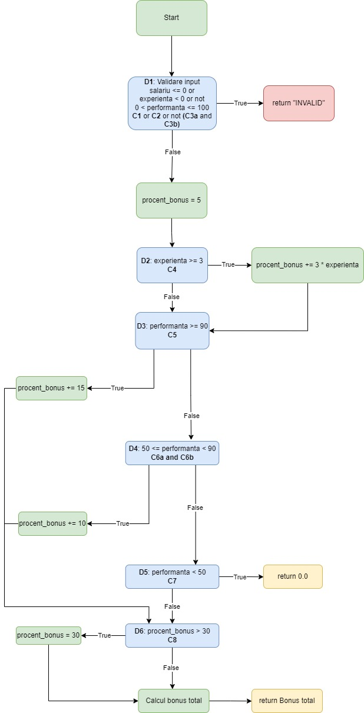

# Proiect Laborator TSS

### Cuprins
1. [Generarea datelor de test](#1-generarea-datelor-de-test)
   - [a) Equivalence Partitioning](#a-equivalence-partitioning)
   - [b) Boundary Value Analysis (BVA)](#b-boundary-value-analysis-bva)
   - [c) Cause-Effect Graphing (CEG)](#c-cause-effect-graphing-ceg)
2. [Stabilirea nivelului de acoperire al testelor](#2-stabilirea-nivelului-de-acoperire-al-testelor)
3. [Transformarea programului într-un graf orientat și găsirea unui set de teste care satisface criteriul MC/DC](#3-transformarea-programului-într-un-graf-orientat-și-găsirea-unui-set-de-teste-care-satisface-criteriul-mcdc)
4. [Crearea unui mutant de ordinul 1 echivalent al programului](#4-crearea-unui-mutant-de-ordinul-1-echivalent-al-programului)
5. [Crearea unui mutant ne-echivalent omorât de către test și un mutant ne-echivalent nevăzut de către test](#5-crearea-unui-mutant-ne-echivalent-omorât-de-către-test-și-un-mutant-ne-echivalent-nevăzut-de-către-test)

### Specificații program

Metoda `calculate_bonus` din clasa `BonusCalculator` calculează bonusul salarial pe baza salariului, experienței și performanței angajatului.
#### `calculate_bonus(salariu: float, experienta: int, performanta: int)`

#### Date de intrare:
- `salariu`: salariul angajatului
- `experienta`: numărul de ani de experiență ai angajatului
- `performanta`: scorul de performanță al angajatului

#### Restricții:
- `salariu` număr întreg pozitiv
- `experienta` număr întreg pozitiv
- `performanta` număr întreg între 0 și 100

#### Reguli de calcul:
- Se verifică datele de intrare, iar dacă oricare dintre ele nu respectă restricțiile, se returnează `INVALID`
- Procentul de bază pentru bonus este 5%.
- Dacă `experienta` este mai mare de 3 ani, se adaugă 3 procente pentru fiecare an.
- Dacă `performanta` este mai mare de 90, se adaugă 15 procente.
- Dacă `performanta` este între 75 și 90, se adaugă 10 procente.
- Bonusul nu poate depăși 30% din salariu.
- Dacă `performanta` este mai mică de 50, bonusul este 0.
- Bonus final = `(salariu * procent_bonus) / 100` 
---
### 1. Generarea datelor de test
#### a) Equivalence Partitioning

Indentificarea claselor de echivalență pentru fiecare parametru de intrare:

| Variabilă     | Partiție de echivalență | Reprezentant | Tip     | Descriere               |
|---------------|-------------------------|--------------|---------|-------------------------|
| `salariu`     | EP_S1                   | 5000         | Valid   | salariu > 0             |
|               | EP_S2                   | 0            | Invalid | salariu <= 0            |
| `experienta`  | EP_E1                   | 4            | Valid   | experienta >= 0         |
|               | EP_E2                   | -1           | Invalid | experienta < 0          |
| `performanta` | EP_PF1                  | 45           | Valid   | 0 < performanta < 50    |
|               | EP_PF2                  | 65           | Valid   | 50 <= performanta <= 90 |
|               | EP_PF4                  | 95           | Valid   | performanta >= 90       |
|               | EP_PF5                  | -10          | Invalid | performanta < 0         |
|               | EP_PF6                  | 110          | Invalid | performanta > 100       |

Construirea cazurilor de testare pe baza claselor de echivalență:

| Caz de test | `salariu` | `experienta` | `performanta` | Rezultat așteptat | Descriere            |
|-------------|-----------|--------------|---------------|-------------------|----------------------|
| T1          | 5000      | 4            | 95            | 1500.0            | Valid                |
| T2          | 5000      | 5            | 95            | 1500.0            | Valid                |
| T3          | 5000      | 3            | 95            | 1450.0            | Valid                |
| T4          | 5000      | 4            | 80            | 1350.0            | Valid                |
| T5          | 5000      | 4            | 65            | 850.0             | Valid                |
| T6          | 5000      | 4            | 45            | 0.0               | Valid                |
| T7          | 5000      | 2            | 95            | 1000.0            | Valid                |
| T8          | 0         | 4            | 95            | INVALID           | Salariu invalid      |
| T9          | 5000      | -1           | 95            | INVALID           | Experiență invalidă  |
| T10         | 5000      | 4            | -10           | INVALID           | Performanță invalidă |
| T11         | 5000      | 4            | 110           | INVALID           | Performanță invalidă |
| T12         | 0         | -1           | -10           | INVALID           | Valori invalide      |
| T13         | 0         | 0            | 110           | INVALID           | Valori invalide      |


Rularea testelor folosind pytest:
```commandline
.venv\Scripts\activate
pytest -v tests/bonus_calculator_ep_tests.py
```
---
#### b) Boundary Value Analysis (BVA)
Identificarea valorilor limită pentru fiecare parametru de intrare

| Parametru       | Prag                   | Sub limită   | Peste limită         |
|-----------------|------------------------|--------------|----------------------|
| `salariu`       | 0 (invalid)            | -1 (invalid) | 1 (valid)            |
| `experienta`    | 0 (valid)              | -1 (invalid) | 1 (valid)            |
| `experienta`    | 3 (prag bonus vechime) | 2 (valid)    | 4 (valid)            |
| `performanta`   | 0 (valid)              | -1 (invalid) | 1 (valid)            |
| `performanta`   | 50 (prag bonus)        | 49 (valid)   | 51 (valid)           |
| `performanta`   | 90 (prag bonus)        | 89 (valid)   | 91 (valid)           |
| `performanta`   | 100 (max valid)        | 99 (valid)   | 101 (invalid)        |
| `procent_bonus` | 30% (plafon)           | 29% (valid)  | 31% (plafon aplicat) |

Construirea cazurilor de testare pe baza valorilor limită:

| Caz de test | `salariu` | `experienta` | `performanta` | Rezultat așteptat |
|-------------|-----------|--------------|---------------|-------------------|
| BVA_T1      | -1        | 4            | 80            | INVALID           |
| BVA_T2      | 0         | 4            | 80            | INVALID           |
| BVA_T3      | 1         | 4            | 80            | 0.27              |
| BVA_T4      | 5000      | -1           | 80            | INVALID           |
| BVA_T5      | 5000      | 0            | 80            | 750.0             |
| BVA_T6      | 5000      | 1            | 80            | 750.0             |
| BVA_T7      | 5000      | 3            | 80            | 1200.0            |
| BVA_T8      | 5000      | 4            | 80            | 1350.0            |
| BVA_T9      | 5000      | 4            | -1            | INVALID           |
| BVA_T10     | 5000      | 4            | 0             | 0.0               |
| BVA_T11     | 5000      | 3            | 50            | 700.0             |
| BVA_T12     | 5000      | 3            | 49            | 0.0               |
| BVA_T13     | 5000      | 3            | 51            | 700.0             |
| BVA_T14     | 5000      | 4            | 90            | 1500.0            |
| BVA_T15     | 5000      | 4            | 89            | 1350.0            |
| BVA_T16     | 5000      | 4            | 91            | 1500.0            |
| BVA_T17     | 5000      | 4            | 101           | INVALID           |

Rularea testelor folosind pytest:
```commandline
.venv\Scripts\activate
pytest -v tests/bonus_calculator_bva_tests.py
```
---
#### c) Cause-Effect Graphing (CEG)

Identificarea condițiilor de intrare și a efectelor:

| Cauză | Conditie de intrare    | Descriere                               |
|-------|------------------------|-----------------------------------------|
| C1    | salariu > 0            | Salariu valid                           |
| C2    | experienta >= 0        | Experiență validă                       |
| C3    | 0 < performanta <= 100 | Performanță validă                      |
| C4    | experienta >= 3        | Experiență >= 3 ani (+3%/an experiență) |
| C5    | performanta >= 90      | Performanță >= 90 (+15%)                |
| C6    | 50 <= performanta < 90 | Performanță între 50 și 90 (+10%)       |
| C7    | 1 <= performanta < 50  | Performanță < 50 (bonus = 0)            |

Efecte identificate:

| Efect | Descriere                              |
|-------|----------------------------------------|
| E1    | INVALID                                |
| E2    | 0                                      |
| E3    | Calcul bonus cu procent bonus calculat |

Tabel de decizie:

| Test | C1 | C2 | C3 | C4 | C5 | C6 | C7 | E1 | E2 | E3 | Exemplu    | Descriere               |
|------|----|----|----|----|----|----|----|----|----|----|------------|-------------------------|
| T1   | F  | -  | -  | -  | -  | -  | -  | X  |    |    | 0,4,80     | Salariu invalid         |
| T2   | T  | F  | -  | -  | -  | -  | -  | X  |    |    | 5000,-1,80 | Experiență invalidă     |
| T3   | T  | T  | F  | -  | -  | -  | -  | X  |    |    | 5000,4,-10 | Performanță invalidă    |
| T4   | T  | T  | T  | F  | F  | F  | T  |    | X  |    | 5000,2,45  | Bonus = 0               |
| T5   | T  | T  | T  | F  | F  | T  | F  |    |    | X  | 5000,2,65  | Bonus +10%              |
| T6   | T  | T  | T  | T  | F  | F  | F  |    |    | X  | 5000,3,80  | Bonus +3% experiență    |
| T7   | T  | T  | T  | T  | T  | F  | F  |    |    | X  | 5000,4,95  | Bonus +15% performanță  |

Rularea testelor folosind pytest:
```commandline
.venv\Scripts\activate
pytest -v tests/bonus_calculator_ceg_tests.py
```

---
### 2. Stabilirea nivelului de acoperire al testelor

Pentru determinarea nivelului de acoperire al testelor am utilizat pytest-cov.
```commandline
.venv\Scripts\activate
pytest tests/bonus_calculator_ep_tests.py --cov=bonus_calculator --cov-branch --cov-report=term-missing --cov-report=html
pytest tests/bonus_calculator_bva_tests.py --cov=bonus_calculator --cov-branch --cov-report=term-missing --cov-report=html
pytest tests/bonus_calculator_ceg_tests.py --cov=bonus_calculator --cov-branch --cov-report=term-missing --cov-report=html
```

#### Rezultate Code Coverage

| Tip teste | Număr teste | Statements | Branches | Coverage |
|-----------|-------------|------------|----------|----------|
| EP        | 13          | 17/17      | 10/10    | 100%     |
| BVA       | 17          | 17/17      | 10/10    | 100%     |
| CEG       | 7           | 17/17      | 10/10    | 100%     |

Toate cele trei seturi de teste au atins un nivel de acoperire de 100% atât pentru liniile de cod executate, cât și 
pentru ramurile logice prezente în cod. Statement coverage confirmă execuția fiecărei instrucțiuni din cod, iar branch 
coverage asigură că toate ramurile condiționale au fost evaluate atât la adevărat, cât și la fals.

##### Equivalence Partitioning (EP) 

Au fost generate `13 cazuri de testare` prin care a fost demonstrată corectitudinea funcției `calculate_bonus`. 
Toate cazurile de testare au fost executate cu succes, acoperind scenariile posibile de 
intrare, atât valide, cât și invalide.

##### Boundary Value Analysis (BVA)

Au fost generate `17 cazuri de testare` care au vizat valori limită (prag limită, sub limită și peste limită) ale
parametrilor de intrare:
- salariu = 0
- experiență = 0 și 3
- performanță = 0, 50, 90 și 100

Testarea BVA a evidențiat comportamentul corect în jurul acestor valori critice unde posibilitatea de erori este mai mare.

##### Cause-Effect Graphing (CEG)

Au fost generate `7 cazuri de testare` bazate pe relațiile cauză-efect identificate în specificații. Acest tip de testare
a asigurat acoperirea combinațiilor logice relevante, a validat relațiile dintre condiții și efecte și a evidențiat dependințele
dintre parametrii de intrare.

##### Comparație între tehnici
| Tehnică | Scop                                  | Avantaj                                                     | Limitare                                   |
|---------|---------------------------------------|-------------------------------------------------------------|--------------------------------------------|
| EP      | Identificarea claselor de echivalență | Simplu de implementat, acoperă o gamă largă de scenarii     | Poate omite cazuri limită                  |
| BVA     | Testarea valorilor limită             | Se concentrează pe zonele critice unde apar erori frecvente | Necesită identificarea corectă a limitelor |
| CEG     | Analiza relațiilor cauză-efect        | Asigură acoperirea combinațiilor logice relevante           | Mai dificil de construit                   |

##### Concluzie

Fiecare tehnică de testare contribuie diferit la calitatea testării. Însumarea rezultatelor obținute din toate cele trei
tehnici oferă o acoperire complementară și o viziune clară cu privire la corectitudinea implementării.

---

### 3. Transformarea programului într-un graf orientat și găsirea unui set de teste care satisface criteriul MC/DC

#### Graful orientat al funcției `calculate_bonus`:


Nodurile reprezintă punctele de decizie și acțiune, iar muchiile sunt tranzițiile bazate pe condițiile de intrare.

##### Condiții și decizii

| Decizie | Condiție asociată                                                                                            | Tip     |
|---------|--------------------------------------------------------------------------------------------------------------|---------|
| D1      | C1: salariu <= 0 **OR** C2: experienta < 0 **OR NOT** (C3a: 0 < performanta **AND** C3b: performanta <= 100) | Compusă |
| D2      | C4: experienta >= 3                                                                                          | Simplă  |
| D3      | C5: performanta >= 90                                                                                        | Simplă  |
| D4      | C6a: 50 <= performanta **AND** C6b: performanta < 90                                                         | Compusă |
| D5      | C7: performanta < 50                                                                                         | Simplă  |
| D6      | C8: procent_bonus > 30                                                                                       | Simplă  |

##### Cerințe MC/DC

Set teste pentru D1

| Test | C1 | C2 | C3a | C3b | Rezultat |
|------|----|----|-----|-----|----------|
| T1   | F  | F  | T   | T   | VALID    |
| T2   | T  | F  | T   | T   | INVALID  |
| T3   | F  | T  | T   | T   | INVALID  |
| T4   | F  | F  | F   | T   | INVALID  |
| T5   | F  | F  | T   | F   | INVALID  |

- C1: T1 -> T2 - C1 se schimbă -> decizia se schimbă
- C2: T1 -> T3 - C2 se schimbă -> decizia se schimbă
- C3a: T1 -> T4 - C3a se schimbă -> decizia se schimbă
- C3b: T1 -> T5 - C3b se schimbă -> decizia se schimbă

Set teste pentru D4

| Test | C6a | C6b | Rezultat |
|------|-----|-----|----------|
| T1   | T   | T   | VALID    |
| T2   | F   | T   | INVALID  |
| T3   | T   | F   | INVALID  |

- C6a: T1 -> T2 - C6a se schimbă -> decizia se schimbă
- C6b: T1 -> T3 - C6b se schimbă -> decizia se schimbă

Set final minim de teste care satisface MC/DC:

| Test | salariu | experienta | performanta | D1      | D4      | Rezultat |
|------|---------|------------|-------------|---------|---------|----------|
| T1   | 5000    | 4          | 80          | VALID   | VALID   | 1350.0   |
| T2   | 0       | 4          | 80          | INVALID | VALID   | INVALID  |
| T3   | 5000    | -1         | 80          | INVALID | VALID   | INVALID  |
| T4   | 5000    | 4          | 0           | INVALID | INVALID | INVALID  |
| T5   | 5000    | 4          | 110         | INVALID | INVALID | INVALID  | 
| T6   | 5000    | 4          | 40          | VALID   | INVALID | 0.0      |
| T7   | 5000    | 2          | 95          | VALID   | INVALID | 1500.0   |

Rularea testelor folosind pytest:
```commandline
.venv\Scripts\activate
pytest -v tests/bonus_calculator_mcdc_tests.py
```

### 4. Crearea unui mutant de ordinul 1 echivalent al programului

Un mutant de ordinul 1 echivalent nu schimbă comportamentul observabil al programului pentru toate cazurile de testare.
Pentru a ilustra acest comportament am modificat pragul bonuslui. În loc de utilizarea `procent_bonus > 30`, 
am schimbat condiția în `procent_bonus >= 30`. Această modificare nu afectează comportamentul funcției, deoarece bonusul
este oricum plafonat la 30%.

Tipul mutației: **Relational Operator Replacement (ROR)**

```python
# Versiune originală
if procent_bonus > 30:
    procent_bonus = 30

# Mutant echivalent
if procent_bonus >= 30:
    procent_bonus = 30
```

Dacă valoarea procentului de bonus este exact 30%, ambele versiuni vor plafona bonusul la 30%, rezultând în același comportament.

### 5. Crearea unui mutant ne-echivalent omorât de către test și un mutant ne-echivalent nevăzut de către test

#### Mutant ne-echivalent omorât de către test

Un mutant ne-echivalent este unul care schimbă comportamentul observabil al programului pentru cel puțin un caz de testare.
Pentru a ilustra acest comportament am modificat condiția de verificare a salariului. În loc de `salariu <= 0`, am schimbat condiția în `salariu < 0`.

Tipul mutației: **Relational Operator Replacement (ROR)**

Test care omoară mutantul: **T2**

```python
# Versiune originală
if salariu <= 0 or experienta < 0 or not (0 < performanta <= 100):
    return "INVALID"

# Mutant ne-echivalent
if salariu < 0 or experienta < 0 or not (0 < performanta <= 100):
    return "INVALID"
```

În loc de "INVALID", dacă salariul este 0, mutantul va permite continuarea execuției, ceea ce poate duce la un calcul 
incorect al bonusului (rezultat = 0.0).

#### Mutant ne-echivalent nevăzut de către test

Un mutant ne-echivalent nevăzut de către test este unul care ar putea schimba comportamentul programului, dar 
nu este detectat de testele existente. Pentru a ilustra acest comportament am modificat calculul procentului de bonus 
în cazul în care performanța este peste 90. În loc de a adăuga 15%, am schimbat valoarea adăugată la `10 - 5`. 

Tipul mutației: **Arithmetic Operator Replacement (AOR)**
Test care nu omoară mutantul: orice test cu performanța sub 90.

```python
# Versiune originală
if performanta > 90:
    procent_bonus += 15

# Mutant ne-echivalent nevăzut de către test
if performanta > 90:
    procent_bonus += 10 - 5
```
